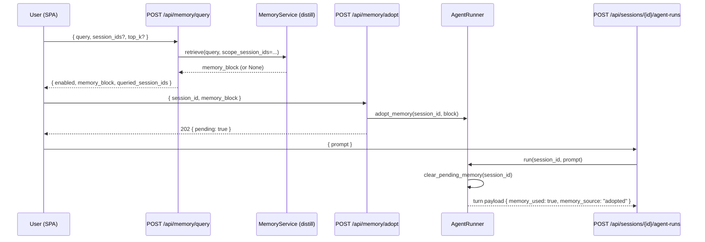

# Stage K Walkthrough: Cross-session memory @ mention + adopt-for-next-turn

**Last updated**: 2026-05-27

Stage K closes the cross-session reference gap that Stages G+J left
open. Distill (Stage G) ingests every freeze and a fork DAG (Stage J)
keeps the lineage visible -- but until Stage K, an operator still had
to leave the chat shell to pull a learning from a *different*
session into the conversation they were in.

The user's framing was:

> 別のセッションへの質問機能を実装したいです。これは別のセッションの
> jsonl を直接クエリするのか、distill 機能を使うのか、別セッションの
> エージェントと対話するのか、どうあるべきでしょうか。
>
> いいね、B を主軸にしましょう。A もフォールバックとして選択できる
> ように頼む。

So Stage K ships:

1. **Path B (primary)** -- distill-backed retrieval scoped to the
   sessions the user picks. The retriever already tracks
   `Learning.source_session`; Stage K threads
   `scope_session_ids: list[UUID] | None` through the entire stack
   (`Learning Store` -> `Retriever` -> atelier `MemoryService` -> REST)
   so the SPA can ask "what canonical / emerging facts match this
   query, restricted to *these* sessions?"
2. **Path A (fallback)** -- per-session raw event substring search via
   `GET /api/sessions/{id}/events/search?q=...&kind=turn`. The path is
   useful when distill is disabled, when the operator wants the
   verbatim turn rather than a distilled rule, or when the session was
   never frozen (so it never reached distill).
3. **Adopt-for-next-turn** -- the user reviews the retrieved block and
   adopts it via `POST /api/memory/adopt`. The block is queued in
   `AgentRunner._pending_memory[session_id]`; the very next agent run
   pops it and prepends it as a `<memory>` segment, *regardless* of
   the server's auto-retrieval setting. The user-turn payload records
   `memory_source: "adopted"` so freeze + replay reflect the
   cross-session reference. Re-adopting overwrites; explicit clear
   wipes; an agent run consumes; no persistence across restarts.
4. **`@ session` UI** -- a header button opens a B/A-tabbed dialog,
   the operator runs the search, previews the block, and adopts it
   onto the next turn. While a block is pending, a chip above the
   input box shows the queued memory and offers a one-click clear.

Together the four pieces give the operator a way to splice prior-
session knowledge into a live chat without context-switching to a
different shell -- the missing piece in the "branch / freeze / fork"
loop the rest of atelier already supports.

## What changed

### Distill (vendored)

| Area | Files |
|------|-------|
| `LearningStore.list_paginated` accepts `source_session_ids` | `vendor/stratoclave-distill/src/stratoclave_distill/store.py` (Protocol), `inmemory.py`, `asyncpg.py` |
| `Retriever.retrieve(..., source_session_ids=)` forwards through both lanes (canonical + emerging) and the BM25 / vector pre-filters | `vendor/stratoclave-distill/src/stratoclave_distill/retriever.py` |
| Tests: empty list short-circuits; multi-session scope passes through | `vendor/stratoclave-distill/tests/unit/test_retriever_scope.py` |

Empty list (`source_session_ids=[]`) means "no allowed sessions" and
yields an empty result; `None` means "no scope filter, all sessions".
The asymmetry is deliberate -- the SPA needs both meanings to keep the
*"all sessions"* default cheap while still allowing the operator to
say "specifically these and nothing else".

### Atelier `MemoryService`

| Area | Files |
|------|-------|
| `MemoryService.retrieve(..., scope_session_ids: Sequence[UUID] \| None = None)` Protocol param | `src/stratoclave_atelier/memory.py` |
| `DistillMemoryService` stringifies + tuples the UUIDs and forwards as `source_session_ids=`; empty list short-circuits to `None` without hitting the retriever | `src/stratoclave_atelier/_distill_memory.py` |
| `NoopMemoryService.retrieve` accepts the param and ignores it (returns `None`) | `src/stratoclave_atelier/memory.py` |
| Auto-retrieval call site (`AgentRunner.run`) leaves `scope_session_ids=None` for backwards-compat behaviour | `src/stratoclave_atelier/agent_runner.py` |

### REST: `/api/memory/{query,adopt}`

| Endpoint | Purpose |
|----------|---------|
| `POST /api/memory/query` | Run a scoped retrieval. Body: `{ query, session_ids?, top_k? }`. Response: `{ enabled, memory_block, queried_session_ids }`. `enabled=False` (Noop) returns `memory_block=None` without erroring; SPA renders this as "memory disabled, fall back to raw search". |
| `POST /api/memory/adopt` | Stash `memory_block` for the next agent run on `session_id`. 202 on success. 404 if the session is unknown; 409 if the session is `frozen` / `archived` (no future run consumes it); 422 on empty block. |
| `GET /api/memory/adopt/{session_id}` | Peek the pending block (used by the SPA chip). Response: `{ session_id, pending, memory_block? }`. |
| `DELETE /api/memory/adopt/{session_id}` | Drop the pending block without consuming it. |
| `GET /api/sessions/{id}/events/search?q=...&kind=turn&limit=10` | Path A fallback. Substring search over event payloads (case-insensitive, JSON dump for non-string payloads). |

The `session_ids` field in `MemoryQueryRequest` is parsed as
`list[UUID]`, which gives free 422 validation for non-UUID input.
`queried_session_ids` echoes the request scope back so the SPA can
render a chip that says "scoped to: A, B, C".

### `AgentRunner._pending_memory`

| Method | Behaviour |
|--------|-----------|
| `adopt_memory(session_id, block)` | Overwrite the queued block. |
| `peek_pending_memory(session_id)` | Return the queued block without consuming. |
| `clear_pending_memory(session_id)` | Pop and return the queued block. |
| `run(...)` | Priority chain: explicit `memory_context=` (caller-provided) > adopted (this dict) > auto (config-driven `MemoryService.retrieve`) > `None`. Records `memory_source` in the turn payload accordingly. |

The new `memory_source: str | None` field on user-turn payloads is the
audit trail. It takes one of `"explicit"`, `"adopted"`, `"auto"`, or
`None` so freeze + replay surface *why* the memory block was on this
turn.

### Frontend (vanilla JS, no new deps)

| Element | Purpose |
|---------|---------|
| `<button id="button-mention" data-testid="chat-mention">@ session</button>` | Header button that opens the dialog. Disabled until a session is active. |
| `<dialog id="mention-panel">` with B/A tabs (`mention-tab-distill`, `mention-tab-raw`) | Switches between the distill scope-search pane and the raw event search pane. The B pane shows a hint banner when distill is disabled. |
| `
` above the textarea | Visible while a block is pending; "Memory queued: <preview>" + a × clear button that hits `DELETE /api/memory/adopt/{sid}`. |
| `chat.js`: `openMentionPanel`, `runDistillSearch`, `runRawSearch`, `adoptMentionPreview`, `renderMemoryChip`, `refreshMemoryChip`, `clearMemoryChip` | Drive the new UI. The session multi-select is populated from `GET /api/sessions` minus the current session. |

## Lifecycle

`memory_source` flows into the SSE event stream so the chat UI can
badge the user turn ("memory: adopted") and the freeze step records
the same value into the JSONL snapshot.

## Path A vs Path B at a glance

| | Path B (distill) | Path A (raw events) |
|--|--|--|
| Granularity | Canonical / emerging *learnings* (rules, facts, gaps) | Verbatim turn payloads |
| Scope | `[learning.source_session in {ids}]`; `None` = all | One target session at a time |
| Output | Pre-rendered `<memory>` block (markdown-ish) | List of events, formatted client-side |
| Requires | distill enabled (`ATELIER_DISTILL_ENABLED=true` + DSN) | Always available, even with distill off |
| Use case | "What did we settle on for X across the workspace?" | "Find the exact moment I said Y in session Z" |

Path A is the deliberate fallback so an operator running
`ATELIER_DISTILL_ENABLED=false` (or a freshly bootstrapped workspace
with no frozen sessions yet) still has *some* way to pull prior
context into the live chat.

## Tests

| File | Coverage |
|------|----------|
| `vendor/stratoclave-distill/tests/unit/test_retriever_scope.py` | Empty list short-circuits, multi-session scope forwards |
| `tests/unit/test_memory.py` | `DistillMemoryService` UUID stringification + empty-list short-circuit; `AgentRunner` priority chain (explicit > adopted > auto > None); pending block is single-shot consumed; clear drops without consuming |
| `tests/unit/test_api_memory.py` | `POST /query` UUID parsing + 422 on non-UUID; `POST /adopt` 202 / 404 / 409 / 422; `DELETE /adopt/{sid}` clear; `GET /adopt/{sid}` peek |
| `tests/unit/test_frontend_mount.py` | `index.html` carries the new ids (`button-mention`, `memory-chip`, `mention-panel` + tabs); `chat.js` ships the orchestration markers (`/api/memory/query`, `/api/memory/adopt`, `openMentionPanel`, `renderMemoryChip`) |

All atelier unit tests stay green (230 pass after Stage K). Distill
unit tests stay green (342 pass).

## Failure modes

* **Distill disabled** -- `POST /query` returns
  `{ enabled: false, memory_block: null }`. The SPA renders the
  banner inside the B pane and the operator switches to A.
* **Empty session scope** -- `session_ids: []` short-circuits
  *before* the retriever runs (so we never make a meaningless query).
* **Frozen session adopt** -- `POST /adopt` rejects with 409 because
  the session has no future run to consume the block.
* **Unknown session adopt** -- 404, no in-process state mutated.
* **Retriever exception** -- `DistillMemoryService.retrieve` logs and
  returns `None`. The SPA shows "No matches" rather than a 500.
* **Agent restart with pending block** -- the dict is in-process, so
  the queue is lost. This is intentional: the user re-adopts after a
  restart rather than risking a stale block being silently spliced
  into a new server instance.

## Knobs

No new env vars in Stage K. The feature reuses `ATELIER_DISTILL_*` from
Stage G and `ATELIER_AGENT_MEMORY` (which already gates auto-retrieval
on the agent run path -- adopted blocks bypass that knob by design).
