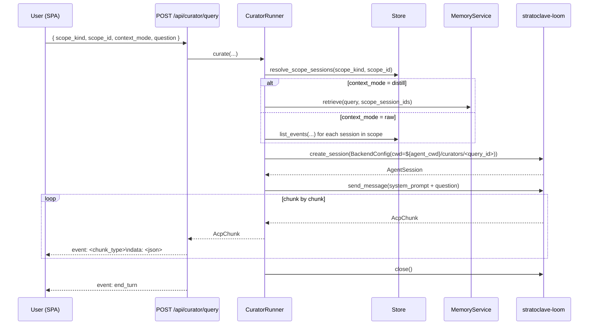

# Stage L Walkthrough: Groups in the Fork DAG + Curator (isolated scope-bound Q&A)

**Last updated**: 2026-05-28 (added "Stage L follow-up: git-root memory guard + DAG colour CSS fix" at the bottom)

Stage L closes two regressions Stage K had left behind:

1. The `@ session` mention panel was awkward to drive (multi-select via
   list, B/A tabs, manual adopt step), and worse,
2. *Adopting* a retrieved memory block back into the active session
   re-introduced exactly the contamination that per-session cwd
   isolation (Stage K follow-up) had just solved.

The user's framing was:

> マージした！次はグループ機能を組み込みましょう。Fork DAG のペインで
> 新しく Group を作って可視化（色を変えて）、Group に root セッション
> を追加できる、root セッションを外す、などができて欲しいです。
> @session のボタンでの検索がすごくやりづらいので、セッションを選択式
> にするのではなく Fork DAG の Group ごと、Fork DAG で指定した session
> に対して（root session までの情報を保持している認識）、でクエリも
> できるし、prompt として指定したものに質問を投げるということもできる
> ようにしてほしい。... ただしこれをしてしまうとせっかく分離して汚染
> を防止しているのに汚染が入る可能性があります。なのでやはり別エージェ
> ントを起動して指定範囲の知識を与えて回答を直で出すような形にしたい
> です。Assistant とは別の名前で回答を出してください（UI の表示の話）。

So Stage L ships:

1. **Group as a first-class scope on the DAG.** Each Group carries a
   color; the DAG outlines root nodes with that color and a right-click
   on a node assigns / removes the group. Forks inherit the group
   transitively (already shipped in Stage J via the per-group fork-graph
   query).
2. **Curator** -- a separate agent process that answers questions about
   a chosen scope (a Group, or one session and every ancestor up to its
   root). The Curator runs in its *own* per-query cwd
   (`${agent_cwd}/curators/<query_id>`), so the Claude Code auto-memory
   directory keyed by `realpath(cwd)` is empty by construction and the
   active chat session cannot be contaminated. The streamed answer
   surfaces in a dedicated dialog labelled **"Curator"**, never the
   chat log.
3. **Removal of the `@ session` mention panel** -- the header button,
   `<dialog id="mention-panel">`, and all `chat.js` orchestration for
   the panel are gone. The memory chip stays (Stage K's adopt-for-next-
   turn still works for cases where the operator deliberately wants the
   block on the active session) but the discoverable entry point is
   now the DAG context menu's "Ask Curator about this session" /
   "Ask Curator about group ..." item.

## What changed

### Backend

| Area | Files |
|------|-------|
| `ForkGraphNode.group_id: UUID \| None` so the DAG payload carries enough info to colour root nodes | `src/stratoclave_atelier/core/types.py`, `src/stratoclave_atelier/fork_graph.py`, `src/stratoclave_atelier/api/schemas.py` |
| `CuratorRunner` (per-query cwd, fresh loom session per call, no warm pool) | `src/stratoclave_atelier/curator.py` |
| Scope resolvers: `resolve_session_chain`, `resolve_scope_sessions` | `src/stratoclave_atelier/curator.py` |
| Context builders: `build_distill_context`, `build_raw_context`, `render_system_prompt` | `src/stratoclave_atelier/curator.py` |
| Typed errors: `CuratorScopeError(ValueError)`, `CuratorContextError(RuntimeError)` | `src/stratoclave_atelier/curator.py` |
| `POST /api/curator/query` SSE endpoint | `src/stratoclave_atelier/api/curator.py` |
| `CuratorRunnerDep` + lifespan wiring (instantiated alongside `AgentRunner` in both injected-store and asyncpg paths) | `src/stratoclave_atelier/api/deps.py`, `src/stratoclave_atelier/server.py`, `src/stratoclave_atelier/api/__init__.py` |

### Frontend

| Element | Purpose |
|---------|---------|
| `<dialog id="curator-panel">` with scope summary chip, raw/distill mode toggle, question textarea, streaming answer area labelled "Curator" | `frontend/static/index.html` |
| Curator dialog styling + streaming-cursor blink | `frontend/static/css/chat.css` |
| `chat.js`: `openCuratorPanel`, `runCuratorQuery`, `consumeCuratorSse`, `handleCuratorFrame`, `curatorScope` / `curatorStream` state, DAG context-menu entries ("Ask Curator about this session" / "Ask Curator about group X") | `frontend/static/js/chat.js` |
| Removal of `<button id="button-mention">`, `<dialog id="mention-panel">`, and the entire `openMentionPanel` / `runDistillSearch` / `runRawSearch` codepath | `frontend/static/index.html`, `frontend/static/js/chat.js` |

### REST contract

| Endpoint | Purpose |
|----------|---------|
| `POST /api/curator/query` | Streaming SSE answer. Body: `{ scope_kind: "group" \| "session", scope_id: UUID, context_mode: "raw" \| "distill", question: str (1..8000), backend?: str }`. Response: `text/event-stream` with `event: <chunk_type>\ndata: <json>\n\n` frames; always ends with `event: end_turn`. |

Error contract on `POST /api/curator/query`:

* `400 / 422` -- request validation (Pydantic). Empty question, bad
  `scope_kind`, malformed UUID.
* `404` -- `CuratorScopeError`. Group or session not found, or the
  session chain walks back to nothing.
* `503` -- `CuratorContextError`. Agent backend disabled
  (`ATELIER_AGENT_BACKEND=none` and no other backends), agent cwd not
  configured for the requested backend, or the requested
  `context_mode="distill"` while distill is disabled.

The 4xx/5xx fire as JSON *before* the SSE stream is opened, so the SPA
gets a clean `resp.ok === false` to surface to the operator instead of
a half-open stream.

## Lifecycle



The cwd at `${agent_cwd}/curators/<query_id>` is created fresh per
call; the loom session is closed in a `finally` branch so even
cancellations clean up the cwd reference. The Claude Code auto-memory
directory keyed by `realpath(cwd)` is always empty for that path,
which is the point: the Curator must not inherit cross-session
learnings -- the assembled context block is the only context it sees.

## Group on the DAG

```
        Stage J fork-graph payload (already group-scoped via /api/groups/{id}/fork-graph)
                              |
                              v
        ForkGraphNode.group_id: UUID | None         <-- Stage L addition
                              |
                              v
        chat.js renders root node outline using state.groups.get(group_id).color
                              |
                              v
        Right-click on a DAG node -> context menu:
          - Rename...
          - --- Curator ---
          - Ask Curator about this session       <-- always
          - Ask Curator about group "<name>"     <-- only when node.group_id present
          - --- (root only) ---
          - Assign group...                      <-- via <dialog id="group-edit">
```

The right-side DAG sidebar exposes a Group panel with create / rename /
recolour / delete affordances; the panel writes through to the
existing `POST /api/groups`, `PATCH /api/groups/{id}`, `DELETE
/api/groups/{id}` endpoints. Assignment from a DAG node updates
`sessions.group_id` directly via `PATCH /api/sessions/{id}`.

## Curator vs Mention panel (Stage K → Stage L)

| | Stage K `@ session` mention panel | Stage L Curator |
|--|--|--|
| Entry point | Header button (always visible) | Right-click on DAG node |
| Scope picker | List multi-select | Implicit: the node you right-clicked on |
| Result destination | Pasted into the *active* session as a `<memory>` block on the next user turn | Streamed into a separate dialog labelled "Curator", never the chat log |
| Contamination risk | Yes -- the active session sees the retrieved text in its turn payload and Claude Code auto-memory | No -- the answer streams to a dialog and the underlying loom session uses its own cwd, so Claude Code auto-memory cannot leak back |
| Context modes | Distill (B) and raw event search (A) | Distill (`context_mode="distill"`) and raw events (`context_mode="raw"`); selected via radio in the dialog |
| Cancel semantics | Adopt-for-next-turn could be cleared with the chip | `closeCuratorPanel()` calls `AbortController.abort()` on the in-flight `fetch`; closing the dialog kills the stream |

The Stage K memory chip and `POST /api/memory/adopt` survive Stage L
unchanged -- they are still the right tool when the operator
*deliberately* wants prior knowledge spliced into the active session
(e.g. continuing a fork that needs ancestor context). Curator is the
right tool when the operator wants to *consult* prior sessions
without contaminating the active one.

## Browser SSE pump (POST + EventSource is not enough)

`EventSource` only does GET, so the SPA cannot use it for the Curator
endpoint. `chat.js` therefore consumes the SSE stream by hand:

```javascript
const resp = await fetch("/api/curator/query", { method: "POST", body: ..., signal: controller.signal });
const reader = resp.body.getReader();
const decoder = new TextDecoder();
let buffer = "";
while (true) {
    const { value, done } = await reader.read();
    buffer += decoder.decode(value, { stream: true });
    let idx;
    while ((idx = buffer.indexOf("\n\n")) !== -1) {
        const frame = buffer.slice(0, idx);
        buffer = buffer.slice(idx + 2);
        handleCuratorFrame(frame, answerEl, statusEl);
    }
    if (done) break;
}
```

`handleCuratorFrame` parses each frame's `event:` and `data:` lines,
JSON-decodes the data payload, and dispatches on the AcpChunk type
(`text_delta` appends to the answer pre-element, `error` populates
the status line, `end_turn` flips the cursor off and resolves the
loop). The `AbortController` from `closeCuratorPanel` cancels the
fetch cleanly when the user dismisses the dialog mid-stream.

## Tests

| File | Coverage |
|------|----------|
| `tests/unit/test_curator.py` (18 tests) | `resolve_session_chain` (root-first walk, unknown returns empty); `resolve_scope_sessions` (group / session-chain / unknown raises / unsupported kind); `build_distill_context` (forwards `top_k=10` + scope ids, disabled raises `CuratorContextError`, empty match returns placeholder); `build_raw_context` (filters to `turn`/`agent_turn`, caps via `max_events_per_session`, empty session shows "no turn events", no sessions returns "(scope had no sessions)"); `render_system_prompt` embeds context + "Curator" label; smoke tests for typed-error subclassing |
| `tests/unit/test_api_curator.py` (8 tests) | `_StubCuratorRunner` swap pattern (lifespan installs the real runner, then we overwrite `app.state.curator_runner` *after* `with TestClient(app) as c:`); SSE happy path (text_delta + end_turn frames); `CuratorScopeError -> 404`; `CuratorContextError -> 503`; empty question -> 422; bad scope_kind -> 422; payload forwarding (`scope_kind` / `scope_id` / `context_mode` / `question` / `backend` reach the runner); default `context_mode` is `"raw"`; the real `CuratorRunner.enabled` is `False` when no backend is configured |
| `tests/unit/test_frontend_mount.py` | `test_curator_panel_shell_elements_are_present` checks dialog ids, testids, "Ask the Curator" copy, and that `chat.js` ships `openCuratorPanel` / `runCuratorQuery` / `/api/curator/query` / "Ask Curator about this session"; `test_mention_panel_is_removed` pins that the Stage K UI is gone (`button-mention`, `mention-panel`, `mention-tab-distill`, `mention-results`, `openMentionPanel`, `runDistillSearch`, `runRawSearch` all absent) but the memory chip helpers (`renderMemoryChip`) survive |

All atelier unit tests stay green (279 pass after Stage L). Lint
(`ruff`) and type check (`mypy`) are clean across the repo.

## Failure modes

* **Backend disabled** -- `CuratorRunner.enabled` returns `False`;
  `curate()` raises `CuratorContextError`; the endpoint returns 503
  with `detail` "agent backend disabled; set ATELIER_AGENT_BACKEND to
  enable (current=...)". The SPA surfaces the detail string in the
  status row of the dialog.
* **Group not found / session not found** -- `CuratorScopeError ->
  404`. The dialog stays open with the failure message; the operator
  can pick a different scope by re-opening from the DAG.
* **Distill mode while distill disabled** -- `CuratorContextError ->
  503` with `detail` "distill memory is disabled on this server; pick
  raw context mode". The SPA leaves the radio at `raw` so the operator
  can re-submit immediately.
* **Empty distill match** -- `build_distill_context` returns a
  human-readable placeholder ("(no distilled memory matched this
  scope; the Curator was given an empty memory block.)") so the
  Curator still sees a coherent prompt rather than an empty `<memory>`
  tag.
* **Raw context cap** -- `build_raw_context(max_events_per_session=200)`
  trims to the most recent 200 turn / agent_turn events per session.
  Older turns are dropped silently; the assumption is that the most
  recent context is what the operator cares about.
* **User aborts mid-stream** -- `closeCuratorPanel()` calls
  `AbortController.abort()` on the in-flight `fetch`; the
  `runCuratorQuery` `try` block sees `controller.signal.aborted` and
  returns silently without flashing an error. The runner's `finally`
  closes the loom session.
* **Loom session close fails** -- logged with
  `logger.exception("error closing curator session %s", query_id)`
  and swallowed; the cwd directory survives for forensic inspection.

## Knobs

No new env vars in Stage L. The Curator reuses:

* `ATELIER_AGENT_BACKEND` / `ATELIER_AGENT_BACKENDS` -- which loom
  backends are usable. Disabled = Curator disabled (503).
* `ATELIER_AGENT_CWD_*` / `ATELIER_AGENT_CWD` -- the *base* directory
  under which `${base}/curators/<query_id>` is created per query.
* `ATELIER_DISTILL_*` from Stage G -- only consulted when
  `context_mode="distill"`.

## Verifying live

```bash
# 1. start the server with --in-memory (no DB or backend required for
#    the shell + 503 path test)
uv run python -m stratoclave_atelier --in-memory --port 8123 &
ATELIER_PID=$!

# 2. shell + curator panel are mounted at /
curl -s http://127.0.0.1:8123/ | grep -E 'curator-panel|curator-question|Ask the Curator'

# 3. chat.js carries the orchestrator
curl -s http://127.0.0.1:8123/static/js/chat.js \
  | grep -E 'openCuratorPanel|/api/curator/query'

# 4. with no backend configured the endpoint is reachable but 503s
curl -s -o /tmp/curator.json -w "%{http_code}\n" \
  -X POST http://127.0.0.1:8123/api/curator/query \
  -H "Content-Type: application/json" \
  -d '{"scope_kind":"session","scope_id":"00000000-0000-0000-0000-000000000000","context_mode":"raw","question":"hi"}'
# -> 503; cat /tmp/curator.json shows
#    {"detail":"agent backend disabled; set ATELIER_AGENT_BACKEND to enable (current='none')"}

# 5. payload validation fires before the runner is invoked
curl -s -o /tmp/curator-422.json -w "%{http_code}\n" \
  -X POST http://127.0.0.1:8123/api/curator/query \
  -H "Content-Type: application/json" \
  -d '{"scope_kind":"bogus","scope_id":"00000000-0000-0000-0000-000000000000","context_mode":"raw","question":"hi"}'
# -> 422

kill $ATELIER_PID
```

For the full streaming path, run with `ATELIER_AGENT_BACKEND=mock`
(or `claude_code`) and the matching `ATELIER_AGENT_CWD_*`; the
endpoint will then stream `text_delta` frames and emit `end_turn`.

## Stage L follow-up: git-root memory guard + DAG colour CSS fix (2026-05-28)

After Stage L landed, two regressions surfaced during live testing:

1. **DAG nodes had no group colour.** Right-click → assign group → the
   `group_id` was persisted, the DAG payload carried it, but the rect
   outline stayed grey.
2. **Cross-session memory contamination.** A brand-new session
   "remembered" the previous session's identity ("俺はサトシ") and
   immediately rewrote that fact into its memory dir. Per-session cwd
   isolation was supposed to make this impossible.

### Bug 1 -- DAG group colour invisible

Root cause: `chat.js::layoutDag` painted the outline via
`rect.setAttribute("stroke", grp.color)`. SVG `setAttribute("stroke",
...)` is a *presentation attribute*; it loses to any matching CSS rule.
`frontend/static/css/chat.css` has `.dag-node rect { stroke:
var(--border) }`, which is a CSS rule, so it consistently overrode the
presentation attribute.

Fix: switch to inline style, which beats CSS rules:

```javascript
// frontend/static/js/chat.js
rect.style.stroke = grp.color;
rect.style.strokeWidth = "2.5px";
```

Pinned by `tests/unit/test_frontend_mount.py::test_chat_js_paints_group_color_via_inline_style`.

### Bug 2 -- Cross-session memory contamination

Root cause: Claude Code persists per-project memory at
`~/.claude/projects/<slug>/memory/`, where `<slug>` is derived **not
from the cwd** but from the *git root* (Claude walks up from cwd
looking for `.git`). When `ATELIER_AGENT_CWD` was nested inside a git
checkout, every per-session cwd
`${agent_cwd}/sessions/<session_id>/...` resolved to the *same* git
root, so every atelier session shared a single memory dir. The Stage K
follow-up split the per-conversation jsonls correctly (those *are*
keyed by cwd), but the auto-memory ignored the per-session cwd
entirely. Result: identity facts written by session A surfaced in
session B as if they had always been there.

Fix has two layers (defence in depth):

1. **Resolve the actual project root in `AgentRunner`.** New
   `_resolve_claude_project_root(cwd)` walks parents looking for
   `.git`; `_claude_project_memory_dir(cwd)` slugs that resolved root.
   `seed_branch_cwd` therefore copies from / writes to the directory
   Claude Code actually uses.

   ```python
   # src/stratoclave_atelier/agent_runner.py
   @staticmethod
   def _resolve_claude_project_root(cwd: Path) -> Path:
       real = cwd.resolve()
       for candidate in (real, *real.parents):
           if (candidate / ".git").exists():
               return candidate
       return real

   @classmethod
   def _claude_project_memory_dir(cls, cwd: Path) -> Path:
       root = cls._resolve_claude_project_root(cwd)
       slug = str(root).replace("/", "-")
       return Path.home() / ".claude" / "projects" / slug / "memory"
   ```

2. **Refuse the bad combination at boot.** Per-session isolation
   silently collapses whenever `agent_cwd` is inside a git checkout
   (because the git-root slug is the same for every session). Config
   now refuses that combination at startup unless the operator opts
   back in:

   ```python
   # src/stratoclave_atelier/config.py
   if (
       self.agent_cwd_isolation == "per_session"
       and not self.allow_agent_cwd_inside_git
   ):
       for name in self.resolved_backends() or ():
           cwd = self.cwd_for_backend(name)
           if cwd and _git_ancestor(Path(cwd)) is not None:
               raise ConfigError(
                   f"agent_cwd for backend {name!r} sits inside a git "
                   f"repository ({_git_ancestor(Path(cwd))}); Claude "
                   "Code keys auto-memory by the git root, so per-session "
                   "isolation will not work and sibling sessions will "
                   "leak identity / context. Move agent_cwd outside any "
                   "git checkout (e.g. ~/.atelier/cwd) or set "
                   "ATELIER_ALLOW_AGENT_CWD_INSIDE_GIT=1 to override."
               )
   ```

   New env knob `ATELIER_ALLOW_AGENT_CWD_INSIDE_GIT=1` is the
   documented escape hatch (e.g. `shared` mode + a git-internal cwd is
   sometimes intentional for operator convenience).

Pinned by:

- `tests/unit/test_agent_runner.py::test_resolve_claude_project_root_finds_git_ancestor`
- `tests/unit/test_agent_runner.py::test_claude_project_memory_dir_uses_git_root_slug`
- `tests/unit/test_config.py::test_agent_cwd_inside_git_rejected_under_per_session`
- `tests/unit/test_config.py::test_agent_cwd_inside_git_allowed_with_escape_hatch`
- `tests/unit/test_config.py::test_agent_cwd_inside_git_allowed_under_shared_isolation`

### Operator hygiene: where to put `ATELIER_AGENT_CWD`

Pick a path that is **not nested in any git repository**. Recommended:
`~/.atelier/cwd` or `~/atelier-workspaces`. Avoid project-internal
locations like `<repo>/.atelier-wk/cwd` -- those will be refused by
the new guard.

If you run Atelier with `ATELIER_AGENT_CWD_ISOLATION=shared` you do
not need the guard (shared mode has no per-session promise to break)
and can keep cwd inside the repo if you must, but you forfeit cross-
session contamination protection.

### End-to-end verification

Performed live against the running server (PID 43820, port 8123):

```bash
mkdir -p ~/.atelier/cwd
ATELIER_AGENT_BACKEND=claude_code ATELIER_AGENT_CWD=$HOME/.atelier/cwd \
  .venv/bin/stratoclave-atelier serve --in-memory --port 8123 \
  > /tmp/atelier-stage-l.log 2>&1 &

# 1. Session A: teach identity
SA=$(curl -s -X POST http://127.0.0.1:8123/api/sessions \
       -H 'Content-Type: application/json' \
       -d '{"title":"contamination-check-A"}' \
     | python3 -c 'import json,sys; print(json.load(sys.stdin)["session_id"])')
curl -s -X POST "http://127.0.0.1:8123/api/sessions/$SA/agent-runs" \
  -H 'Content-Type: application/json' \
  -d '{"prompt":"俺の名前はサトシ。覚えたら「覚えた」とだけ返して。",
       "backend":"claude_code"}'
# Wait ~25s for Claude Code to stream + persist memory

# 2. Session B (brand-new): is contamination present?
SB=$(curl -s -X POST http://127.0.0.1:8123/api/sessions \
       -H 'Content-Type: application/json' \
       -d '{"title":"contamination-check-B"}' \
     | python3 -c 'import json,sys; print(json.load(sys.stdin)["session_id"])')
curl -s -X POST "http://127.0.0.1:8123/api/sessions/$SB/agent-runs" \
  -H 'Content-Type: application/json' \
  -d '{"prompt":"俺の名前を知ってる？知らないなら「知らない」とだけ返して。",
       "backend":"claude_code"}'
# -> Session B replies「知らない」

# 3. Confirm memory dirs are isolated
ls ~/.claude/projects/-Users-akazawt--atelier-cwd-sessions-$SA/memory/
# -> MEMORY.md  user_name.md   (session A wrote here)
ls ~/.claude/projects/-Users-akazawt--atelier-cwd-sessions-$SB/memory/
# -> empty / nonexistent      (session B did NOT inherit anything)

# 4. DAG group colour
G=$(curl -s -X POST http://127.0.0.1:8123/api/groups \
      -H 'Content-Type: application/json' \
      -d '{"name":"contamination-check","color":"#FF6B6B"}' \
    | python3 -c 'import json,sys; print(json.load(sys.stdin)["group_id"])')
curl -s -X PUT "http://127.0.0.1:8123/api/sessions/$SA/group" \
  -H 'Content-Type: application/json' -d "{\"group_id\":\"$G\"}" >/dev/null
curl -s "http://127.0.0.1:8123/api/groups/$G/fork-graph" | python3 -m json.tool
# -> nodes carry group_id; chat.js paints rect.style.stroke = grp.color
```

Expected outcome:
- Session A "覚えた", Session B "知らない" (contamination eliminated).
- `MEMORY.md` only under Session A's project dir; Session B's project
  dir stays empty.
- The DAG node for Session A is outlined in `#FF6B6B`.
